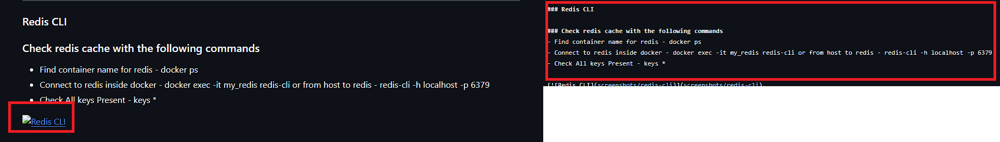

# 🚀 Product Service API with Spring Boot and Redis Configuration

A Spring Boot application demonstrating **Redis integration** for caching and configuration management.  
This project is ideal for learning and implementing **Redis in a Spring Boot environment**.

---

## 📌 Features
- ⚡ **Spring Boot**
- 🗄 **MongoDB**
- 🐳 **Docker**
- 📝 **SLF4J Logging**
- 📬 Tested with **Postman**

---

## 🛠️ Tech Stack
- **Backend:** Spring Boot 3.x
- **Database/Cache:** MongoDB , Redis
- **Build Tool:** Maven
- **Language:** Java 21
- **Other Tools:** Docker (for running Redis)
---

## 📂 Project Structure
```plaintext
Spring-Boot-Redis-Config/
│── src/main/java/com/techie/springbootrediscache/   # Main source code
│── src/main/resources/                             # Config files (application.properties/yml)
│── pom.xml                                         # Maven dependencies
│── README.md                                       # Documentation

## Prerequisites
Before running this project, make sure you have:
- Java 21 or above
- Maven
- Docker
- MongoDB Atlas cluster set up
- Redis (local or remote)
```
---
## Setup & Run

###  Clone the Repository
```
git clone  https://github.com/SantojeetChakraborty/Spring-Boot-Redis-Config.git
cd Spring-Boot-Redis-Config

## 📸 Screenshots
```

### Docker Setup

#### 1. Build Docker Images - Go to project directory where the docker-compose.yml file is present then run : docker compose up --build -d 
[](screenshots/docker-compose.png)

#### 2. Docker Containners Running Status - To view running containers run : docker ps
[](screenshots/docker-ps.png)

#### 3. View Docker Logs - To view application logs run : docker compose logs -f
[](screenshots/docker-logs.png)

#### 4. Check Docker Desktop - Check docker desktop and confirm redis and spring boot application is running
[](screenshots/docker-desktop.png)

#### 4. Check Running Status of Application - On your browser navigato to **http://localhost:8080/** to confirm springboot app runs locally
[](screenshots/check-running-status.png)

---

### API Endpoints (Postman)

#### 1. Add Product : http://localhost:8080/api/product
[](screenshots/add-product.png)

#### 2. Get all Products : http://localhost:8080/api/product
[](screenshots/get-all-products.png)

#### 3. Get Product by ID : http://localhost:8080/api/product/{productID}
[](screenshots/get-product-by-id.png)

#### 3. Update Product : http://localhost:8080/api/product/{productID}
[](screenshots/update-product.png)

#### 3. Delete Product : http://localhost:8080/api/product/{productID}
[](screenshots/delete-product.png)

---

### Redis CLI

### Check redis cache with the following commands
- Find container name for redis - docker ps
- Connect to redis inside docker - docker exec -it my_redis redis-cli or from host to redis - redis-cli -h localhost -p 6379
- Check All keys Present - keys *
  
[](screenshots/redis-cli.png)
